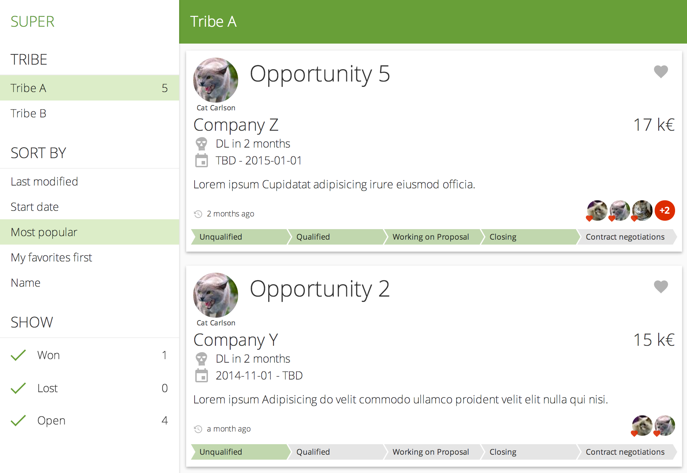

# SUPER - Salesforce Upcoming Project Evaluation Rankings

# About

The purpose of this project is to promote transparency of the sales pipeline and help sales decide what cases to prioritize. This would be done by providing an interface for tribe-members to see upcoming cases and allow them to vote for the cases they find interesting. There could also be functionality for commenting and asking for more information about a case.



[Public demo](http://super-demo.herokuapp.com/)

# Development

Requirements:

 * [Node and npm](http://nodejs.org/)
 * [CouchDB](http://couchdb.apache.org/)

LiveReload might also need [Grunt](http://gruntjs.com/) if you don't have support for that in your editor of choice.

## Setting up

All you need to do is clone the repository and run `npm start`.
This will install all necessary dependencies and start the server at [localhost:8000](http://localhost:8000).

```bash
$ git clone https://github.com/futurice/futurice-super.git
#...
$ npm start
```

**NB.** `/index.html` is generated *only once* when `npm start` is run. When developing, you may want to point the browser to `/nonvulcanized.html` instead.

To configure the application you need to set some environment variables or edit the settings.js file. If you edit the settings.js file make sure you don't commit any super secret stuff by accident.

One way to set the environment variables is to create a file with the correct values and source it when starting the server as shown below.

```bash
export SFORCE_USER="user@example.com"
export SFORCE_PASSWORD="password"
export SFORCE_TOKEN="token"
export COUCHDB_URI="http://localhost:5984"
export COUCHDB_DB="super"
```

And when developing you run: `source variables_file`.

Install and run CouchDB, then run `node updater.js`.

For LiveReload via Grunt:

```bash
$ grunt
```

# Salesforce connection

We're using the [JSforce](http://jsforce.github.io/) library for the Salesforce API connection.

From salesforce documentation:

	When accessing salesforce.com either via a desktop client or the API from outside of your company's trusted networks:

	If your password = "mypassword"
	And your security token = "XXXXXXXXXX"
	You must enter "mypasswordXXXXXXXXXX" in place of your password

So, to test queries from REPL (assuming you have installed JSforce globally):

```bash
$ jsforce
# ...

> login('user@example.com', '<password><token>')
{ id: '0000',
  organizationId: '0000',
  url: 'https://login.salesforce.com/id/0000/0000' }

> query('SELECT Id, Name FROM Account LIMIT 1')
{ totalSize: 1,
  done: true,
  records:
   [ { attributes: [Object],
       Id: '0000',
       Name: 'Company X' } ] }
```

If you're using `curl`, you can do:

```bash
curl https://eu1.salesforce.com/services/data/v30.0/ -H "Authorization: Bearer <token>"
```

You can also use [Force.com Explorer](https://developer.salesforce.com/page/ForceExplorer) to explore the Salesforce API and test queries.

More information at [salesforce.com](https://www.salesforce.com/us/developer/docs/api_rest/).

# API

/api/tribes

```json
[
	{
		"name": "100 - Avalon",
		"prettyName": "Avalon"
	},
	{
		"name": "120 - South Side",
		"prettyName": "South Side"
	},
	{
		"name": "130 - Vesa",
		"prettyName": "Vesa"
	},
	{
		"name": "500-Tammerforce",
		"prettyName": "Tammerforce"
	},
	{
		"name": "700 - Berlin",
		"prettyName": "Berlin"
	},
	{
		"name": "800-London",
		"prettyName": "London"
	}
]
```

/api/view/all

```javascript
{
	total_rows: 219,
	offset: 0,
	rows: [
		{
			id: "000000000000000000",
			key: "000000000000000000",
			value: {
				_id: "000000000000000000",
				_rev: "1-1254df1da4e08d203069cc9ed0925148",
				attributes: {
					type: "Opportunity",
					url: "/services/data/v30.0/sobjects/Opportunity/000000000000000000"
				},
				Id: "000000000000000000",
				Name: "Opportunity XYZ",
				Account: {
					attributes: {
						type: "Account",
						url: "/services/data/v30.0/sobjects/Account/000000000000000000"
					},
					Name: "Account ABC",
					Id: "000000000000000000"
				},
				Owner: {
					attributes: {
						type: "User",
						url: "/services/data/v30.0/sobjects/User/000000000000000000"
					},
					Name: "Alice",
					Id: "000000000000000000"
				},
				Description: "New amazing business opportunity. Social network for birds.",
				Amount: 1000000,
				CloseDate: "2014-08-07",
				Probability: 75,
				StageName: "Working on Proposal",
				IsClosed: false,
				IsWon: false,
				Type: null,
				Futu_Team__c: "123 - FireTribe"
			}
		},
		...
	]
}
```

/api/*

Proxy for CouchDB database.

E.g. `/api/_all_docs`

```javascript
{
	total_rows: 220,
	offset: 0,
	rows: [
		{
			id: "000000000000000000",
			key: "000000000000000000",
			value: {
				rev: "1-302d274ffc44da9ae8a987fc0daf6694"
			}
		},
		...
	]
}
```

# Deployment

### Locally

```bash

$ git archive -o production.tar master

$ scp production.tar super.futurice.com:/tmp/

```

### On the server

```bash

$ cd /tmp

$ sudo stop super-server

$ sudo tar xvf production.tar -C /opt/super

$ sudo start super-server

$ rm /tmp/production.tar

(opt)$ sudo service apache2 restart

```

If you've modified the database you'll need to restart the updater.

```bash
$ sudo stop super-updater
$ sudo start super-updater
```

## Apache2 REMOTE_USER

The service expects a custom header of 'x-forwarded-user' to be passed to it, in order to identify the user using the service. This can be done in apache by forwarding the REMOTE_USER environment variable.

```bash
<Location />
        Order deny,allow
        Deny from all
        Satisfy any
        AuthType mod_auth_pubtkt
        Require valid-user
		# ...

        ProxyPass http://127.0.0.1:8000/
        ProxyPassReverse http://127.0.0.1:8000/

        RequestHeader set X-Forwarded-User %{REMOTE_USER}s
</Location>
```

# License

[BSD 3-Clause](LICENSE.txt)